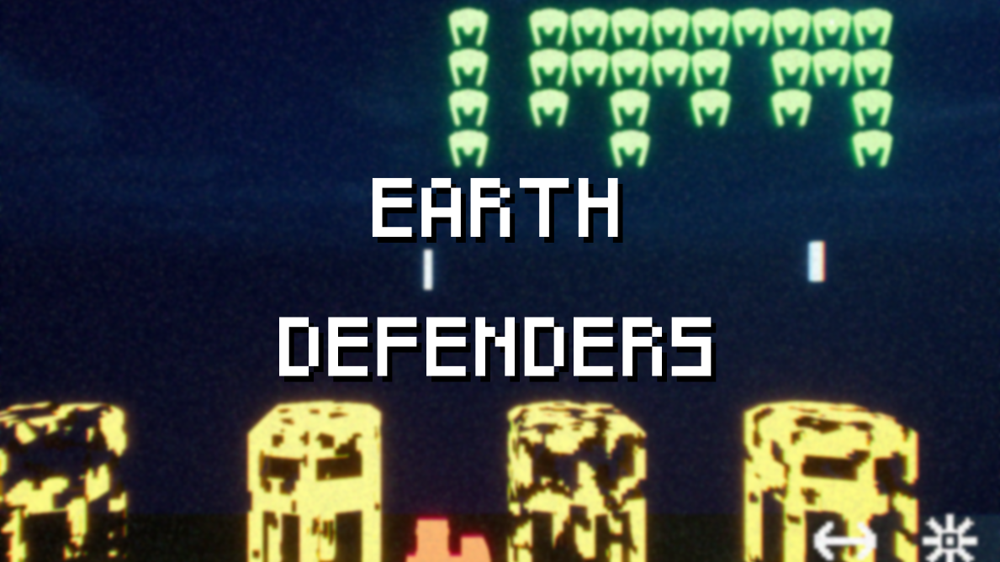

## Short game made in Unreal for GMTK 2023 Game Jam

Earth Defenders is a small game I made for the Game Maker's Toolkit 2023 jam. The theme was "Roles Reversed" and I actually liked the idea and decided to make an reversed Space Invaders. Unfortunately I was very busy that weekend and only had a few hours to work on this game instead of the usual 48 hours.

### This page is currently under construction. Come back later once it's finished!