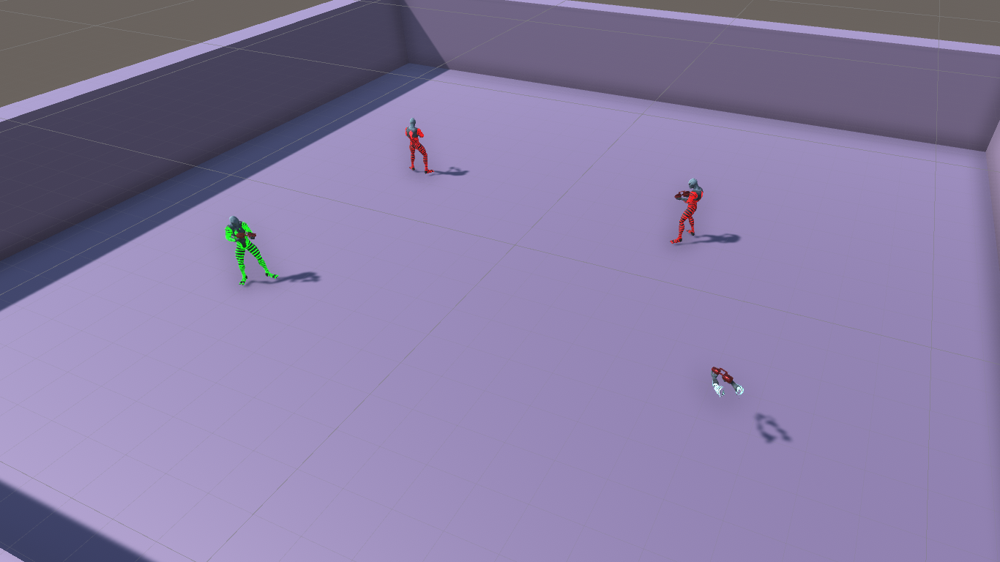

This is an FPS I made on Unity as a project for a college subject about multiplayer games. I made this game with Mirror Networking. I wanted to make a simple project but with a relatively robust networking and that could be hosted on Amazon Web Service.

The game can be downloaded on [Itch.io](https://fr4ct1ons.itch.io/neon-shooter). If required, the password is "```onlinegamepreview```" The source code can also be found on [GitHub](https://github.com/lucena-fr4ct1ons/neon-shooter-multiplayer).